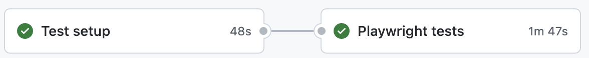

# Playwright: Run E2E Tests against your Vercel Deployment using GitHub Actions

   
  
   

## 📎 Blog post

On my blog post [How to run E2E tests against your Vercel deployment using GitHub Actions](https://www.janpoth.de/en/blog/playwright-vercel-e2e-tests) you can find more information about this repository.
